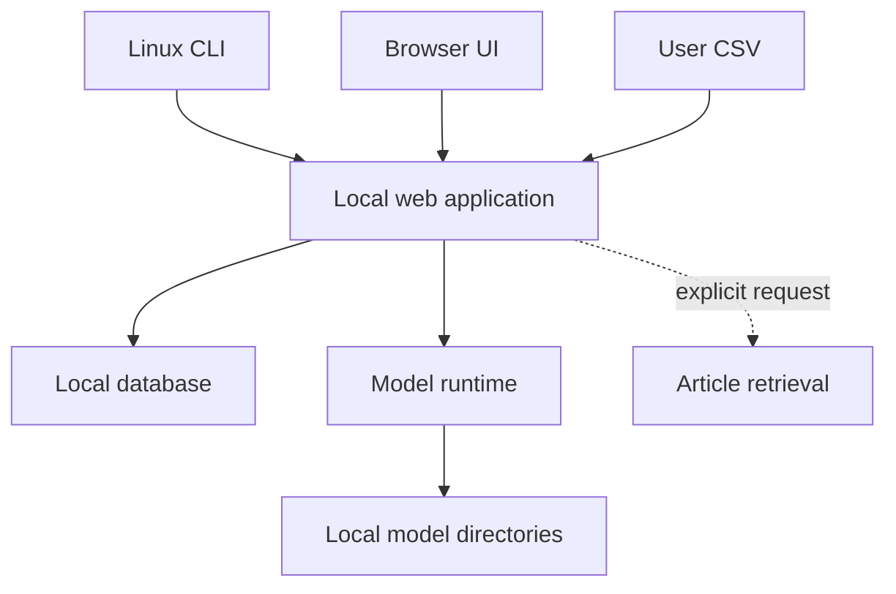
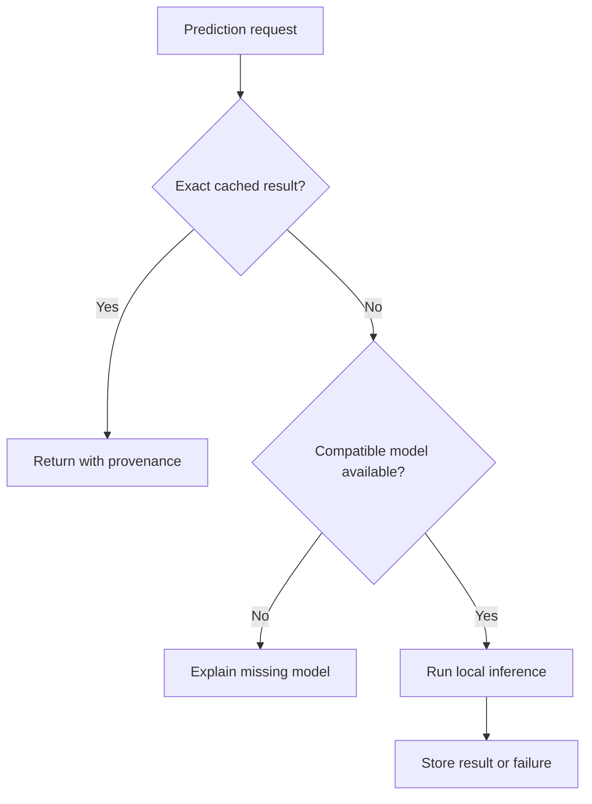

# Architecture

**Status:** Minimal proposed architecture. Technology choices remain provisional
until released checkpoints have passed the compatibility tests.

## 1. Architectural constraints

- Linux-first command-line startup.
- Local browser interface.
- Local model inference.
- English-only software interface and English-only article inference.
- One user and one machine in the MVP.
- An optional user-selected CSV supplies historical predictions; the tracked
  sample documents its structure but is not a required seed database.
- New results stored in each user's transactional personal local database.
- Model files remain outside the database.
- Large-model failures must not corrupt stored history.

## 2. Component view

The first implementation may run as one application process, but long model
loads and inference calls should execute as managed background jobs. A separate
distributed queue is not required for the MVP.

## 3. Suggested module boundaries

| Module | Responsibility |
| --- | --- |
| CLI/configuration | Parse paths and options, validate configuration, start the server |
| Web/UI | Present minimal navigation, searchable histories, article selection, model status, exact tables, and charts |
| Import service | Validate and incrementally project allowed fields from a user-selected CSV without modifying it |
| URL/article service | Resolve canonical article URLs and normalized publisher domains |
| Model registry | Recursively discover checkpoints, ignore hidden paths, recognize file/directory layouts, and expose compatibility status |
| Model loader registry | Reconstruct notebook-defined base/tokenizer recipes and safely load supported `state_dict` files or PEFT adapter directories |
| Inference service | Encode extracted text, run local prediction, apply softmax, and record run metadata |
| Aggregation service | Build publisher evaluations from compatible article predictions |
| Persistence | Store imports, entities, jobs, predictions, and evaluation provenance |
| Retrieval service | Use `newspaper3k` to fetch one article or discover and extract a requested number from one publisher |
| Language service | Use `langdetect` after extraction and reject or exclude content not detected as English |

## 4. Storage strategy

Using the user's CSV as the mutable application database would make
deduplication, concurrent jobs, schema evolution, and provenance unnecessarily
fragile.

The initial storage design is therefore:

- **user-selected CSV:** optional, immutable import source whose size and row
  count are not fixed;
- **tracked sample CSV:** small synthetic schema example, not automatically
  imported as product history;
- **SQLite:** proposed personal local database containing allowed imported
  records and every new article, prediction, and publisher evaluation;
- **model directories:** external local artifacts referenced by path and
  checksum;
- **application data directory:** logs, database, cached metadata, and optional
  managed model copies.

SQLite is a proposal, not yet a locked technology choice, but it matches the
single-user local scope and the current dataset size.

### Minimum persistent entities

| Entity | Essential identity or content |
| --- | --- |
| `publishers` | unique normalized domain, homepage URL, and optional display metadata |
| `articles` | unique canonical URL, publisher domain, detected language, and optional title, text, and author metadata |
| `models` | model ID, path, checksum, family, fold, loader-recipe version, base/tokenizer dependencies, compatibility status |
| `prediction_runs` | status, timing, parameters, runtime, hardware, error |
| `article_predictions` | canonical article URL, model, run, predicted class, five optional model probabilities |
| `publisher_evaluations` | publisher, model, aggregation version, result, warnings |
| `evaluation_articles` | exact predictions included in each publisher evaluation |
| `imports` | source path/checksum, schema version, time, row counts, projected columns, warnings, errors |

Imported and locally created records carry an origin flag, for example an
import checksum or `local`, while remaining searchable through one interface.
Reimporting an unchanged source is idempotent, and application updates must not
erase the user's personal records.

### Protected-data boundary

The user's private full experimental CSV may be selected locally, but the
importer must project only an explicit allowlist containing model outputs and
the minimum approved identifiers required to associate them with articles.

It must omit, before persistence:

- original reference labels;
- original reference scores;
- metadata supplied by the reference rating provider;
- any field whose redistribution status has not been approved.

Import warnings may name a blocked column but must not log its values. Protected
fields must not enter SQLite, caches, API responses, browser state, or exports.

## 5. Request flow

The cache first resolves the canonical URL. A stored prediction is reusable
when both canonical URL and selected model identity match. No text hash or page
revision check is performed in the MVP.

Before a multi-article job starts, all final canonical URLs must resolve to one
normalized publisher domain. A mismatch is a validation error and no partial
inference should begin.

For a publisher homepage request, `newspaper3k` receives a user-chosen article
count, discovers candidate URLs, validates that they belong to the same
publisher domain, extracts their text, and then passes accepted articles
through the normal cache/inference flow.

Every newly extracted text is checked with `langdetect` before an inference job
is created. Only `en` is accepted. The extracted text is sent unchanged to the
model tokenizer; there is no separate text-cleaning stage. A rejected language
result is stored only as diagnostic job metadata and never as a completed
prediction.

## 6. Startup and model availability

Startup model discovery recursively checks default model locations plus any
command-line file or directory paths. It does not descend into hidden
directories such as `.ipynb_checkpoints`. Each candidate is classified as
compatible, invalid, or unavailable.

No-model startup is a supported state:

- any imported history and personal database remain browsable;
- the server starts normally;
- the terminal prints the official OSF release URL, expected artifact layouts,
  directory structure, and example command;
- the frontend displays model status, the same setup guidance, and a clickable
  OSF download link;
- new evaluation controls are disabled or redirect to model setup.

No-dataset startup is also supported: the application opens the existing
personal database or an empty history and displays the CSV import instructions.

The Models page always exposes the official release URL:

<https://osf.io/r9atz/overview?view_only=e4bda170a3e74ca3ae245475d4486d74>

Recognized official filenames such as `bert_fold_1.pt` select a built-in
family recipe regardless of whether their parent is named `Fold 1`, another
fold label, or an arbitrary directory. Mistral is recognized as an extracted
PEFT fold directory containing `adapter_config.json`,
`adapter_model.safetensors`, `tokenizer_config.json`, and `tokenizer.json`, plus
the approved 24B base identity declared by its configuration. `README.md` is
optional and is not interpreted as configuration. The fold number is recorded,
but no particular fold and no complete set of five folds is required. All four
family recipes are derived from the supplied notebooks and remain subject to
release-artifact compatibility tests.

## 7. Model registration and security

Custom Transformers artifacts are not automatically safe. Some model formats
or loading options can execute Python code, and unsafe serialized files can
execute code during deserialization.

The MVP should therefore:

- accept only explicitly trusted local model artifacts;
- prefer `safetensors` weights;
- load official plain PyTorch checkpoints as tensor-only `state_dict` data,
  using `weights_only=True` where the supported PyTorch version provides it;
- validate a Mistral PEFT directory's declared base model, LoRA configuration,
  tokenizer files, and adapter weight format before loading it;
- keep `trust_remote_code` disabled by default;
- never download or execute model-supplied code implicitly;
- validate paths and prevent path traversal outside approved model roots;
- ignore hidden discovery directories and avoid following directory symlinks
  outside the selected model root;
- show exactly which base model, adapter, and revision will be loaded;
- require explicit confirmation for any configuration that can execute custom
  code.

Registration through the browser should normally register a local path. Copying
multi-gigabyte models into application storage should be an explicit separate
operation.

## 8. Network behavior

- Default bind address: `127.0.0.1`.
- No network access is required to browse imported history.
- No article text is sent to a remote inference service.
- No remote translation service is used; non-English articles are unsupported.
- Outbound network access occurs only for an explicit article fetch, an
  explicit model setup/download action, or retrieval of a required base
  configuration/tokenizer that the user has approved.
- Once base models, tokenizers, and dependencies are cached, inference can run
  without network access.
- A submitted URL is normalized and checked locally first. Only a local miss
  may trigger redirects and canonical-page lookup, followed by a second local
  history check.
- Binding to another interface is outside the default local security model and
  must display a warning; authentication would then be required.

## 9. Technology direction

The likely implementation direction is a Python backend because the existing
models use the Transformers ecosystem. A local web framework and SQLite are
appropriate candidates. The frontend technology should be chosen only after
the required screens and deployment method are settled; a heavy client-side
framework is not automatically necessary.

The frontend uses a small set of reusable components: searchable tables,
article-selection controls, status banners, model result cards, and accessible
bar charts. Chart input comes from the same API response as the exact numeric
table so visual and tabular values cannot diverge.

Packaging options to evaluate after a vertical prototype:

- Python package plus virtual environment;
- `pipx`-installable command;
- container image;
- standalone application bundle.

Containerization may simplify dependencies but can complicate GPU access and
large local model mounts, so it should not be selected without a hardware test.

## 10. Primary technical risks

| Risk | Initial mitigation |
| --- | --- |
| A `.pt` checkpoint lacks tokenizer/configuration files | Use versioned built-in recipes and preflight the required local cache or approved download |
| Released checkpoint keys differ from notebook assumptions | Strict key/shape compatibility test before model registration |
| A released Mistral directory is incomplete or differs from `save_pretrained()` output | Validate its standard PEFT files/configuration and fail closed before loading the 24B base |
| Notebook checkpoint folders are mistaken for models | Ignore hidden directories such as `.ipynb_checkpoints` during recursive discovery |
| Mistral 24B cannot run on ordinary hardware | Preflight RAM/VRAM checks and document supported precision/quantization |
| Historical rows are reused under the wrong model | Unique canonical-URL and model-identity prediction constraint |
| Prediction-file import consumes excessive memory | Stream/chunk import and index in SQLite |
| A protected source field enters the public database | Explicit allowlist, blocked-column test, and value-free error logging |
| Browser freezes during inference | Background jobs and progress/status polling |
| A custom model executes code | Trusted-local policy, safe formats, remote code disabled |
| An article changes while retaining its URL | Accepted MVP limitation: the existing prediction is reused until an explicit refresh feature is added |
| Publisher aggregation mixes incompatible predictions | Database constraints and explicit compatibility validation |
| A multi-article request mixes publishers | Resolve all URLs and reject mixed normalized domains before inference |
| Publisher crawling returns too few or irrelevant pages | Define discovery sources, article filters, ordering, and user-visible partial-result behavior |
| No models are installed | Supported history-only state with synchronized terminal and frontend setup instructions |
| Application update overwrites personal results | Keep import sources immutable and personal data in a separate persistent database |
| Historical probabilities are missing for some models | Show `Not available`; disable probability aggregation without fabricating values |
| Softmax values are interpreted as calibrated confidence | Label them as model probabilities and show a calibration warning |
| `langdetect` rejects valid English articles | Expose the detected result and define/test failure behavior for short or ambiguous texts |
| Minimal UI hides required capabilities | Keep five primary navigation items and place advanced detail within article/publisher pages |
